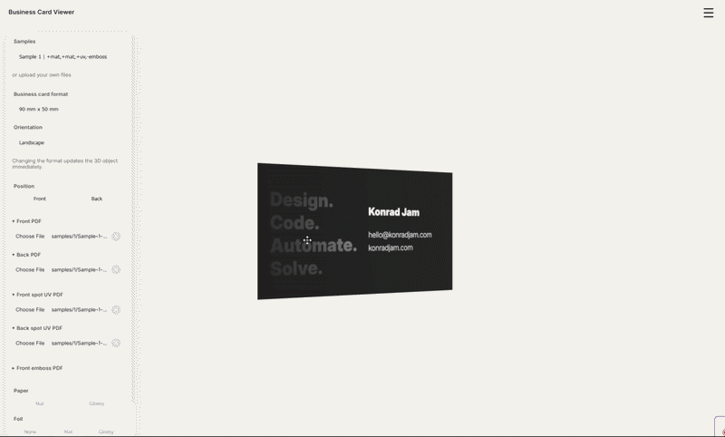

# 3D Business Card Visualizer: Pre-Press Virtualization Tool
#### Final Project for Harvard University's CS50x
#### Author: Konrad Jamroziak
#### Video Demo: [YouTube](https://youtu.be/hn1Gp2mjQiI)

---

## 📑 Table of Contents
1. [Introduction](#introduction)
2. [Demo](#demo)
3. [The Core Problem](#the-core-problem)
4. [Key Features](#key-features)
5. [Technical Architecture](#technical-architecture)
    - [The Rendering Pipeline](#the-rendering-pipeline)
    - [Special Effects (PBR Materials)](#special-effects-pbr-materials)
6. [File Structure & Module Breakdown](#file-structure--module-breakdown)
7. [Design Choices & Challenges](#design-choices--challenges)
8. [Installation & Local Development](#installation--local-development)
9. [Usage Guide](#usage-guide)
10. [Author Information](#author-information)

---

## 🌟 Introduction
The **3D Business Card Visualizer** is a high-fidelity web application built to bridge the gap between abstract pre-press production files and human perception. Developed as a final project for **CS50x**, it leverages modern web technologies to simulate professional printing finishes such as **Spot UV Varnish** and **Embossing/Debossing** in an interactive 3D environment.

## Demo


## 🎯 The Core Problem
As a DTP (Desktop Publishing) operator with over a decade of industry experience, I have observed a recurring "imagination gap." In the printing world, specialized finishes are represented as flat, black-and-white vector masks. While these files are technically perfect for production, they are incomprehensible to most clients. 

This application serves as a **Pre-visualization (Pre-viz) tool**. It takes standard PDF production files and interprets them as physical properties—turning a black mask into a reflective clearcoat layer or a displacement map for tactile embossing.

## ✨ Key Features
*   **Real-time PDF Interpretation:** Directly renders PDF pages into high-resolution textures.
*   **PBR Material Simulation:** Uses Physically Based Rendering to mimic paper, foil, and varnish.
*   **Dynamic Special Effects:**
    *   **Spot UV:** Selective reflectivity based on custom masks.
    *   **Embossing:** Real-time geometry deformation using displacement mapping.
*   **Camera System:** Intuitive 3D orbit controls with programmatic view presets (Front, Back, Side).
*   **Customizable Formats:** Support for multiple card dimensions (90x50mm, 85x55mm) in both Portrait and Landscape orientations.

## 🛠 Technical Architecture

### The Rendering Pipeline
The application implements an asynchronous pipeline to handle the heavy lifting of PDF processing:
1.  **File Ingestion:** PDFs are loaded via `FileReader` or `fetch`.
2.  **PDF.js Worker:** A background worker parses the PDF and renders it to a hidden `HTMLCanvasElement` at a high resolution (target width of 1600px+) to maintain crispness.
3.  **Texture Generation:** The canvas is mapped to a `THREE.CanvasTexture` with an `sRGB` color space for accurate color reproduction.
4.  **GPU Upload:** The texture is passed to the WebGL renderer and applied to the corresponding material slot.

### Special Effects (PBR Materials)
I utilized the **`MeshPhysicalMaterial`** in Three.js, which is the most advanced material for simulating real-world physics:
*   **Clearcoat Layer:** The Spot UV mask is applied to the `clearcoatMap` property, allowing us to control where light reflects without affecting the base color.
*   **Displacement Mapping:** For embossing, I used a high-poly `BoxGeometry` (400x400 segments). The embossing mask is interpreted as a height map, physically moving the vertices of the card mesh along their normals.

## 📂 File Structure & Module Breakdown

### Core Modules (`src/`)
*   `main.js`: The application's entry point and bootstrap logic.
*   `app/app.js`: Orchestrates the UI structure and initial state.

### 🎥 Graphics Engine (`src/scene/` & `src/camera/`)
*   `createCard.js`: **The Heart of the Project.** Contains the logic for the PBR material, geometry manipulation, and texture swapping.
*   `initScene.js`: Sets up the WebGL renderer, scene graph, and animation loop.
*   `viewPresets.js`: Defines the mathematical positions for smooth camera transitions.

### 📄 Document Processing (`src/pdf/`)
*   `renderPdfToTexture.js`: Handles the conversion of PDF vectors into pixel-data textures using PDF.js.
*   `handlePdfUpload.js`: Middleware logic for file validation and state updates.

### 🎮 Interface Logic (`src/menu/`)
*   `uploadManager.js`: Manages the complex state of multiple file inputs (Front, Back, UV, Emboss).
*   `selectSample.js`: Provides a curated set of sample files to demonstrate the app's capabilities.

## 🧠 Design Choices & Challenges

### 1. Performance vs. Quality
Using `DisplacementMapping` requires a high-density vertex grid. To keep the app performing at 60 FPS while maintaining visual quality, I optimized the vertex count to a sweet spot (400x400) and implemented proper texture disposal to prevent memory leaks during file uploads.

### 2. Why Vanilla JavaScript?
While frameworks like React are popular, I chose **Vanilla JavaScript (ES6+)**. This was a deliberate architectural decision to:
*   Demonstrate mastery over the DOM and browser APIs.
*   Maintain a lightweight footprint without the overhead of heavy abstractions.
*   Showcase "clean code" principles through modularity and separation of concerns.

### 3. Lighting Complexity
A business card is a thin object. To make it look "real," I had to implement a three-point lighting system (Key, Fill, and Rim) that rotates with the camera or remains static to highlight the glossiness of the Spot UV varnish.

## 🚀 Installation & Local Development

### Prerequisites
*   [Node.js](https://nodejs.org/) (v16.0.0 or higher)
*   [npm](https://www.npmjs.com/) (usually bundled with Node.js)

### Setup
1.  **Clone the Repository:**
    ```bash
    git clone https://github.com/konradjam/business-card-viewer.git
    cd business-card-viewer
    ```

2.  **Install Dependencies:**
    ```bash
    npm install
    ```

3.  **Run Development Server:**
    ```bash
    npm run dev
    ```

4.  **Build for Production:**
    ```bash
    npm run build
    ```

## 📖 Usage Guide
1.  **Exploration:** Use the **Samples** section in the sidebar to see how the app handles complex designs.
2.  **Custom Upload:** 
    *   Upload a `Front.pdf` and `Back.pdf`.
    *   Upload a `SpotUV.pdf` (Black/White mask) to see the gloss effect.
    *   Upload an `Emboss.pdf` to see the card physically deform.
3.  **Interaction:** Use your mouse to rotate (Left Click), pan (Right Click), and zoom (Scroll). 
4.  **Views:** Use the camera preset buttons to quickly snap to the Front or Back view.

---

## 👤 Author Information
*   **Name:** Konrad Jamroziak
*   **edX Login:** Konrad Jamroziak
*   **GitHub:** KonradJam
*   **Background:** 15+ years of DTP and Pre-press Expertise.

> This project is a final submission for **CS50x 2026**.

---
*Generated by the author as part of the CS50x curriculum.*
